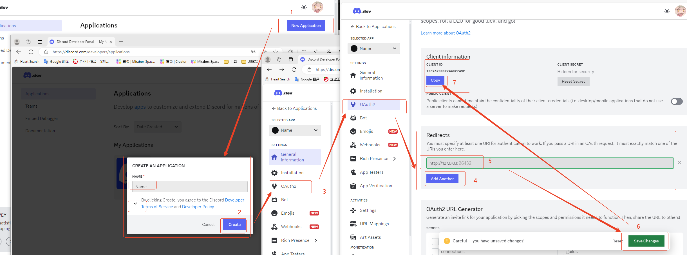

# How to use?

## 1. Get Client ID

Click this link to jump to the discord dev

Create an app and add a redirect address: http://127.0.0.1:26432

## 2. Authorization

After copying the ID, fill it into the discord plugin and click Request Authorization to authorize it before use.